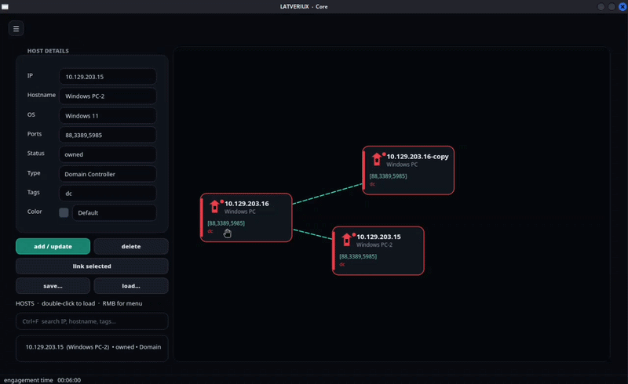
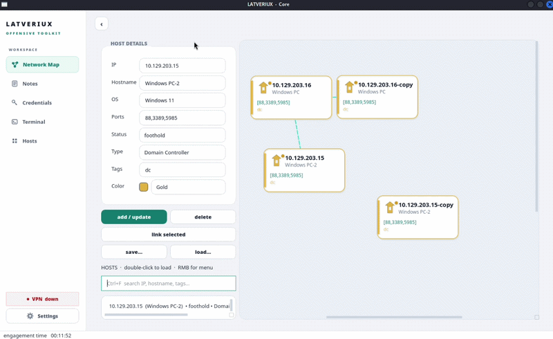
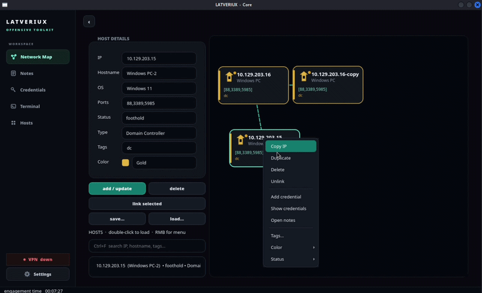
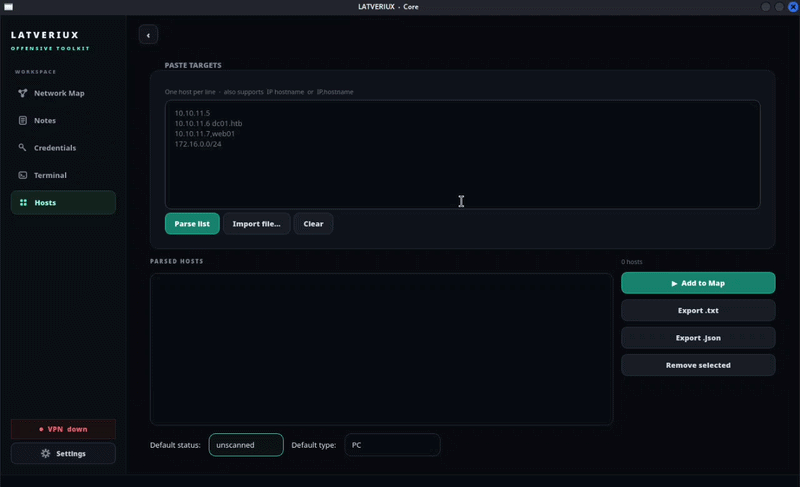
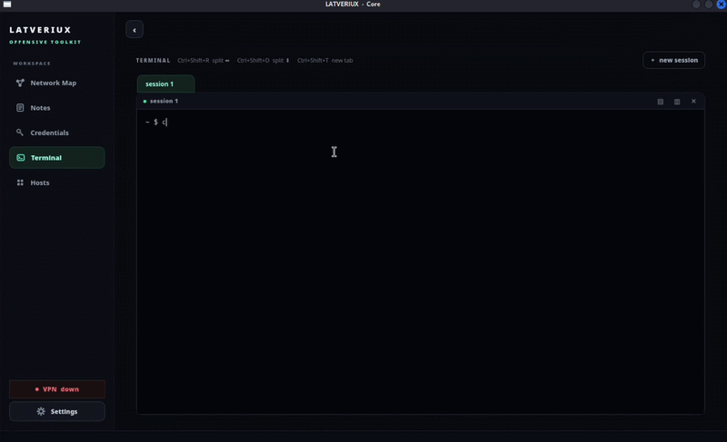
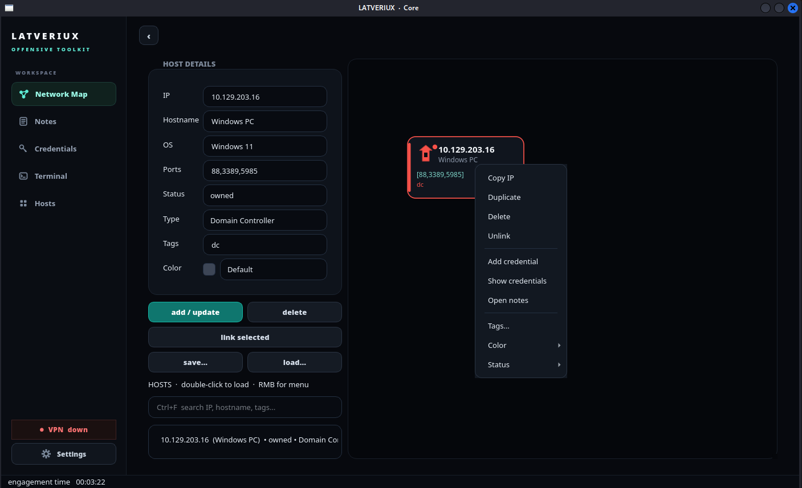
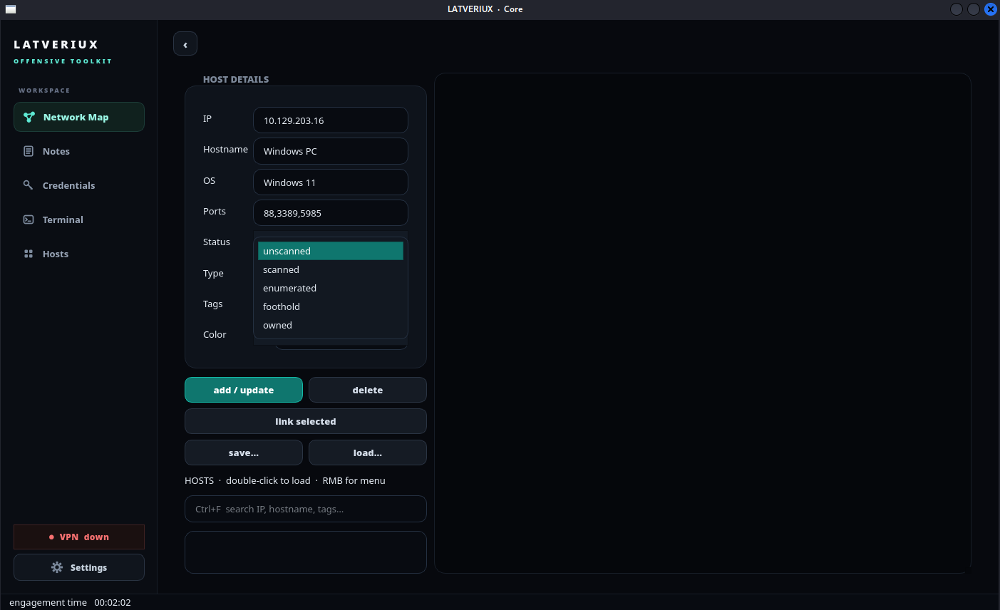
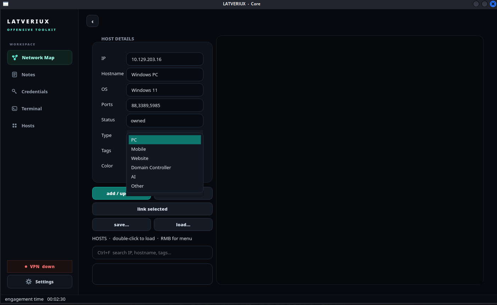

### Disclaimer
This tool is provided for **authorized security research and educational purposes only**.
- Only use this tool on systems you own or have explicit written permission to test
- The authors assume no liability for misuse or damage caused by this tool
- Users are responsible for complying with all applicable local, state, and federal laws
- This tool comes with no warranty - use at your own risk

By using this software, you agree that you will not use it for any illegal or unauthorized activities.

## Prerequisites:

- Python 3.8 or newer
- pip
- PyQt5

## Installation:

```
git clone https://github.com/SAsecurityN/latveriux.git
cd latveriux

# Use the tool:
python3 latveriux.py
```

## About:

***Latveriux*** is a tool built for pentesters by a pentester - to make your space more organizied, using this tool, you can:
- Create network maps, with specifying types, IPs, Hostnames, OS, Open Ports, Status (from unscanned to owned), add tags for each target - you can also link targets between each other


- When you add a new host, a new note for it will automatically appear in the "Notes" section - you can also create/delete notes on your own, notes support Markdown syntax 


- Often happens that you are given numerous targets - this tool lets you bulk add numerous targets at once, specifying (for all - not for single) their type (AI/Mobile/DC/PC/Other) and status


- Built in terminal, so that you don't have to even leave the app, to, e.g., call `nxc`, `curl` or `nmap`! **BEWARE**: msf (Metasploit) might result in lag in terminal - if this happens, press CTRL + C


- The app supports **both light and dark themes**

- Right-click a host on the map to copy the IP, duplicate, delete, unlink, add or show credentials, open that host's notes, and set tags, color, or status.


- Status goes from `unscanned` to `scanned`, `enumerated`, `foothold`, then `owned`. Types: PC, Mobile, Website, Domain Controller, AI, Other.



## Settings

Open **Settings** in the sidebar:
- Dark or light theme
- Show or hide the engagement timer

## License

MIT. See [LICENSE](LICENSE).

Use only on systems you own or have written permission to test.
 
